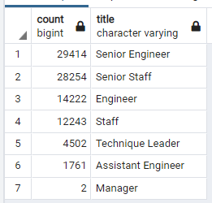
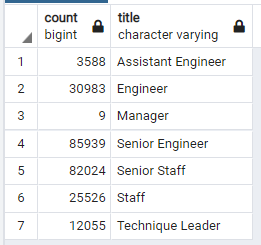
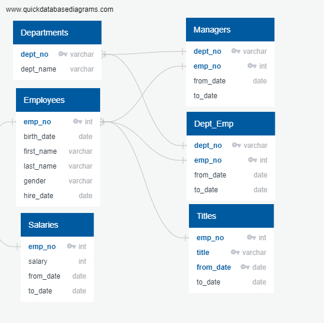

# Pewlett_Hackard_Analysis
Using SQL- relational databases to determine the number of employees retiring at Pewlett Hackard. 
Looking at birth dates ranging from 1952 to 1955 and hired dates from 1985 to 1988.

## Overview of the analysis:
In this project we are helping Bobby in the Humans Resources department at Pewlett Hackard. The company wants to prepare for several employee retirements and want to define how many employees are retiring and which departments they work. 

## Results:
The queries that we constructed in this project have indicated that the "silver tsunami" is coming for Pewlett Hackard.
If we break it down by number of employees retiring by job title, we can see the following information:

* A total of 90,398 employees are about to retire from the company.
* "Senior Engineers" make up 33% of the employees retiring 
* "Senior Staff" make up 31% of the employees retiring
* "Engineers" as a whole make up 50.2% of the employees retiring. 

The numbers above demonstrate that there will be a mass departure of senior experiential knowledge. It will be difficult to counter the knowledge lost.
On the plus side only two managers are retiring. This will at least minimize the need to train new leadership.

With the oncoming loss of a big chunk of the company's employees, the company is considering a mentorship program. 
We found that there are 1549 employees eligible for the mentorship program. 

## Summary:

The results show that there are 240,124 total employees with 90,398 of those employees retiring in the next year. From this we can deduce that more than a third of Pewlett Hackard employees are going to be retiring, a percentage of 37.64%. This ultimately means there are not enough employees to mentor the next generation of employees. The company may need to expand the eligibility requirements for mentors to improve the mentors to employee ratio.

## ERD schema
The ERD schema that was used to build queries for this challenge.

